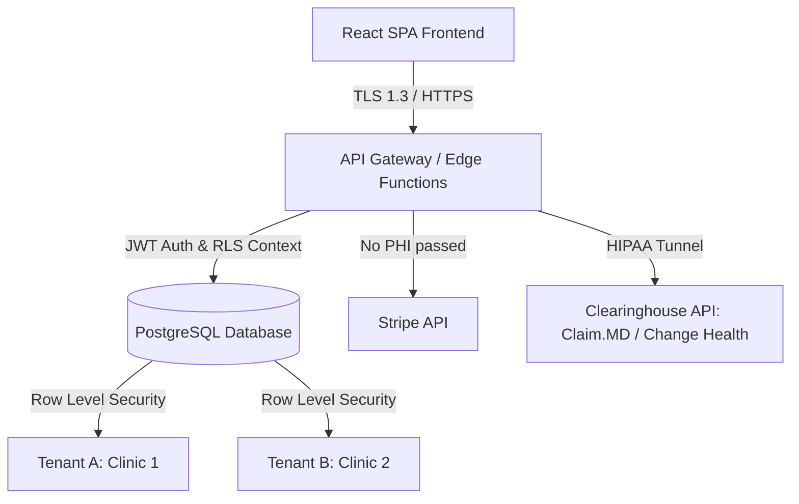

# AccuWorld: Production Transition Blueprint
### Operational, Architectural, and Regulatory Guide for Solo Developers and Small LLCs
> **Created:** 2026-06-26

Transitioning AccuWorld from a frontend prototype to a commercial-grade, multi-tenant Software-as-a-Service (SaaS) platform for solo practitioners requires addressing strict healthcare regulations, complex third-party integrations, and infrastructure security. 

As a solo developer or small LLC, your strategy must focus on **minimizing operational overhead, using compliant managed services, and reducing custom security implementations**. This document outlines the essential elements you must consider.

---

## 1. HIPAA, BAA, & Regulatory Compliance
To legally store Protected Health Information (PHI) in the United States, your application must comply with the **Health Insurance Portability and Accountability Act (HIPAA)**.

### A. Business Associate Agreements (BAAs)
A BAA is a legal contract that shifts liability for data breaches to the vendor for their portion of the infrastructure. **You cannot use any service that handles PHI unless they sign a BAA.**
* **Managed Database:** 
  * *Supabase:* Requires their **Team Plan** ($250+/month) or Enterprise plan to sign a BAA.
  * *AWS:* Signs BAAs across major services (RDS, Cognito, S3, ECS) under standard terms, but requires you to configure them securely.
  * *Aptible / Heroku Shield:* Premium HIPAA-compliant hosting platforms (starting at $200–$500/month) that simplify compliance by enforcing strict network isolation.
* **Authentication:** Cognito or Supabase Auth.
* **Log Drains:** Datadog or AWS CloudWatch (HIPAA tiers).
* **Emails & SMS:** SendGrid (requires their HIPAA-compliant Silver/Gold plans, ~$90+/month) or Twilio (requires a BAA, which is only available on certain contract levels).

### B. Access Control & Security Policies
* **Multi-Factor Authentication (MFA):** Mandatory for healthcare applications. You should enforce TOTP (Authenticator app) or SMS-based MFA.
* **Automatic Session Timeout:** Enforce automatic logout after 15 minutes of inactivity (a strict HIPAA requirement).
* **Role-Based Access Control (RBAC):** Your database layer must enforce the role gates designed in the prototype (e.g., preventing Front Office users from querying clinical SOAP notes).

### C. Immutable Audit Logging
You must maintain an immutable log of all actions containing PHI. If a practitioner is audited or suspects a data breach, these logs are legally required.
* **What to Log:** Who accessed which patient record, when they accessed it, what changes were made, and exports of charts.
* **Implementation:** Create a `system_audit_logs` table in your database. Write to this table via database triggers or an API middleware. Ensure this table has **INSERT-only** permissions; even database administrators must not be able to UPDATE or DELETE logs.

---

## 2. Infrastructure & Database Architecture



### A. Multi-Tenant SaaS Isolation
Since you are selling to multiple independent clinics, you must ensure that under no circumstances can Clinic A see Clinic B's data.
* **Row-Level Security (RLS):** In PostgreSQL, add a `tenant_id` (or `clinic_id`) to every single table.
* Define a global tenant context based on the logged-in user's JWT.
* Write Postgres RLS policies: 
  ```sql
  CREATE POLICY tenant_isolation_policy ON patients
  FOR ALL USING (tenant_id = auth.jwt() ->> 'tenant_id');
  ```
* **Database Backups:** Set up Point-in-Time Recovery (PITR) with at least 35 days of retention. Backups must be encrypted at rest (AES-256).

### B. Deployment & Frontend Hosting
* Standard Vercel accounts do not sign BAAs. However, if your frontend contains **no PHI** (i.e., it only loads code, assets, and fetches data from your secure backend API), you can host the static SPA on Vercel or Cloudflare Pages.
* All data requests must flow directly to your HIPAA-compliant backend API (e.g., Supabase, AWS Gateway, or Render Private Network with BAA).

---

## 3. Insurance Checking & Clearinghouses
Automating the manual eligibility checks and claims submission requires integrating with a healthcare clearinghouse.

### A. Clearinghouse Candidates
* **Claim.MD:** Very developer-friendly, cost-effective, and popular among solo medical developers. Provides robust APIs for eligibility checks (270/271) and electronic claims submission (837).
* **Change Healthcare:** The largest clearinghouse, but has complex API boarding processes and strict minimum volume fees.
* **Eligible.com / Ribbon Health:** Modern API wrappers around legacy clearinghouses. Expensive but easier to integrate.
* **Waystar:** Large enterprise clearinghouse, less ideal for a solo developer due to high setup fees.

### B. Operational Flows to Implement
1. **Real-time Eligibility Check (EDI 270/271):** The user enters patient insurance details. The app calls the clearinghouse API, which queries the payer (e.g., Blue Cross) and returns benefit status, copay, and deductible info in seconds. You must parse this complex JSON/XML response into the clean UI dashboard indicators designed in the prototype.
2. **Claim Submission (EDI 837P):** When a visit is completed, compiles CPT/ICD-10 codes into an 837P electronic claim file and transmits it to the clearinghouse.
3. **Electronic Remittance Advice (EDI 835 / ERA):** The clearinghouse receives payment notifications from payers and sends them to your app, allowing you to mark invoices as "Paid by Insurance" automatically.

---

## 4. EMR Feature Hardening (Production Requirements)

### A. Immutable SOAP Notes
In a real EMR, clinical charts are legal documents. Once signed, they must be locked to prevent retroactive alteration.
* **Sign & Lock Flow:** Add a `status` field (`draft | locked`) to the `visits` table. When the practitioner clicks "Sign & Lock", set the status to `locked` and store a cryptographic hash of the note.
* **Addenda System:** If a locked chart needs a correction, the database must prevent editing the original row. Instead, create a separate `visit_addenda` table linked to the visit. Render the addendum below the original note, signed and timestamped.

```
+-------------------------------------------------------------+
|                       SOAP Note (Locked)                    |
| Signed by Dr. Priya Sharma, L.Ac. on 2026-06-25 15:30      |
+-------------------------------------------------------------+
|                                                             |
| [Locked Original SOAP Content]                              |
|                                                             |
+-------------------------------------------------------------+
                           |
                           v (Linked Relation)
+-------------------------------------------------------------+
|                     Addendum #1 (Signed)                    |
| Signed by Dr. Priya Sharma, L.Ac. on 2026-06-26 10:15      |
+-------------------------------------------------------------+
|                                                             |
| Note: Correcting acupuncture points used; ST36 was needle-   |
| ed bilaterally instead of unilaterally as originally noted. |
|                                                             |
+-------------------------------------------------------------+
```

### B. CPT & ICD-10 Code Lifecycle
* You must license or integrate a standardized lookup database for ICD-10 (diagnosis codes) and CPT (billing codes).
* Maintain a local cache of common acupuncture codes (e.g., `97810`, `97811`, `97813`, `97814`) to keep searches fast.

---

## 5. Billing & Payment Processing (Stripe Integration)
To avoid the legal liability of storing credit cards and bank accounts, use a third-party processor.

### A. Avoiding BAA Requirements for Stripe
Stripe does **not** sign BAAs for standard accounts. To use Stripe legally without violating HIPAA:
* **Tokenize Customer Identifiers:** Do not pass the patient's name, medical condition, or specific treatment details in Stripe metadata.
* **Integration Strategy:** In Stripe, create a generic Customer with `id: cus_12345`. In your secure database, map `patient_id` to `stripe_customer_id`. Pass only the invoice amount and a generic reference (e.g., `Invoice #1042`) to Stripe. 

### B. Financial Reconciliations
* Support **Stripe Terminal** for physical card readers in the office.
* Provide manual recording options (Cash, Check, Zelle, Venmo) to reconcile insurance copays and patient responsibilities.

---

## 6. Patient Communication & Messaging
Practitioners want automatic SMS reminders, online booking, and secure intake forms.

### A. Non-PHI SMS/Email Communications
* Traditional SMS and standard email are unencrypted and **not HIPAA-compliant** for transmitting health details.
* **Reminders:** Keep automated notifications strictly operational. (e.g., *"Hi Maria, you have an appointment with AccuWorld on Monday, June 29th at 2:00 PM. Reply C to confirm."* — No mention of conditions, treatments, or acupuncture).
* For detailed messaging, implement a secure, authenticated **Patient Portal** where patients must log in to view clinical details.

### B. Electronic Signatures
* Patients must sign Consent to Treat, HIPAA disclosures, and financial agreements.
* Integrate with a HIPAA-compliant e-signature service (e.g., DocuSign HIPAA tier, HelloSign API with BAA, or custom canvas drawing stored securely in your database).

---

## 7. Business, Operations, & Legal Considerations
As a solo developer or small LLC, your legal liability must be carefully managed.

### A. Essential Business Insurances
1. **Cyber Liability Insurance:** Covers data breaches, notification costs, ransom demands, and regulatory fines. Essential when holding health data.
2. **Technology Errors & Omissions (E&O):** Protects you if your software goes down, bugs cause billing errors, or critical clinical charts are lost.

### B. Data Portability & Offboarding (Legal Right to Data)
* Medical regulations require practitioners to keep patient files for several years (often 5–10 years depending on the state).
* **Export Tool:** Build an exporter that dumps all client charts in standard PDF or CSV format. If a customer leaves your platform, you must provide this data so they can migrate it.

### C. Developer Access to PHI
* **Customer Support:** If a practitioner encounters an issue with a chart, you cannot simply log into their account and look at patient data without a strict internal policy.
* **Database Admin Access:** Limit your production database access. Avoid querying production tables containing names/DOBs directly. Utilize anonymized database dumps for debugging local environments.

---

## 8. Phased Launch Plan (From Prototype to Launch)

```
+--------------------+      +--------------------+      +--------------------+
|  Phase 1: Secure   |      |  Phase 2: Billing  |      |   Phase 3: Launch  |
|  EMR & Scheduling  | ---> |   & Clearinghouse  | ---> |   & Growth SaaS    |
|   (3 - 4 Months)   |      |   (2 - 3 Months)   |      |   (Ongoing)        |
+--------------------+      +--------------------+      +--------------------+
```

### Phase 1: Secure EMR & Scheduling (Timeline: 3–4 Months)
* **Goal:** Migrate React prototype to Supabase Team tier or AWS.
* **Action Items:**
  * Configure PostgreSQL with Row-Level Security.
  * Integrate Supabase Auth (with MFA).
  * Build the immutable audit log table.
  * Implement the EMR "Sign & Lock" feature for charts.
  * Launch beta with a select group of 2–3 solo practitioners using manual billing (printing superbills).

### Phase 2: Billing & Clearinghouse (Timeline: 2–3 Months)
* **Goal:** Automate payments and claim submissions.
* **Action Items:**
  * Integrate Stripe for card payments and card terminals.
  * Integrate with **Claim.MD** or **Eligible API** for real-time eligibility checks.
  * Develop EDI 837P claim file generation.
  * Obtain cyber liability and tech E&O insurance policies.

### Phase 3: Launch & Growth SaaS (Timeline: Ongoing)
* **Goal:** General availability commercialization.
* **Action Items:**
  * Implement Stripe Billing / Subscription management for SaaS seats ($40–$80/month).
  * Build online patient self-scheduling and intake forms portal.
  * Establish a customer service workflow with remote screen sharing policies.
